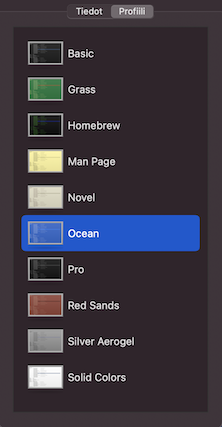

# mp

Scripts for setting up [Multipass](https://multipass.run) virtual machines, in the way of WSL, but on macOS.

<!--
> [!NOTE]
> [!TIP]
> [!IMPORTANT]
> [!WARNING]
> [!CAUTION]
-->

> [!NOTE]
>
>Also check out [Lima](https://lima-vm.io) - Linux Machines. This repo is not using that but the script should be easy to apply. Lima supports port forwards (yay!) and may be more stable to use than Multipass. The author hasn't tried it, yet. (Jun'25)

## Background

**Why to sandbox?**

World is a risky place. Sandboxing allows you to separate *business account* (emails etc.) from *developer account* (that pulls in stuff from third party sources on the Internet), without disturbing the workflow, too much.

One can use containers for development, but Docker Desktop feels too big, for this author. And they've become greedy.

**Discipline**

Sandboxing of course needs discipline. The `mp` approach is done so that:

1. Tooling is separate from development repos

   This is important so that your repos are not cluttered by toolchain choices. It also allows the repo to work "just fine" with native tooling (on Ubuntu Linux), if someone so wishes. This is especially important for open source projects: we *do not impose using `mp`* on others!!! 

2. Composability

   The internal structure allows to take any Ubuntu VM, and curry certain tools on top of it. E.g. `npm`; then `wrangler` if you need such. Or Rust, and curry embedded tooling on top. Things aren't rigid, and aren't repeated.

**Alternatives**

1. Local VM's

	- [Linux machines](https://lima-vm.io)

2. Fully cloud-based sandbox-as-a-service

	- [Jetbrains Space](https://www.jetbrains.com/space/)
	- ..other vendors have similar
	
	This can be ideal for you, but this author prefers to have the *option* of locally hosted, offline-capable development.


## Requirements

- Latest Multipass installed

The system is intended to work on all macOS, Linux and Windows hosts, but is only tested on macOS. If you find issues, please create an issue!

>Note: For Windows, Pro versions of the OS are recommended since only they provide Hyper-V (native) virtualization.

<!-- Developed with:
- macOS 15.5
- Multipass 1.15.1
-->

## Usage

*tbd. This is intended to change, due to the composable approach*

```
$ rust/prep.sh
[...]
```

>It works the same for `web/prep.sh`.

```
Multipass IP (rust): 192.168.64.74

cargo 1.80.1 (376290515 2024-07-16)
rustc 1.80.1 (3f5fd8dd4 2024-08-06)
usbip (usbip-utils 2.0)

```

To add a project folder to be shared between the host (macOS) and the Linux side:

```
$ multipass stop rust-emb
$ multipass mount --type native {path-to-folder} rust-emb:
$ multipass start rust-emb
```

Then:

```
$ multipass shell rust-emb
```

You are now in an Ubuntu sandbox.

> [!WARN]
> 
> Multipass (on Mac) has had stability difficulties with mounts, since 1.13. This is why the scripts - and the instructions above - stop a VM before changing its things.


## Hints

### Separate color for the VM terminal

Change your Multipass terminal's look by `(right click)` > `Show Inspector`. Different coloring helps tremendously!



*Figure 1. Ocean is the author's favourite*  <!-- brief editor, from the 1990's -->

### Accessing USB devices `#embedded`

Multipass does not provide USB pass-through. There are ways around this, however. Look for USB/IP (Windows and Linux can be used as a server); also, some development tools have native remote protocols ([`probe-rs`](https://probe.rs)).

<!-- #hidden
## 📛WARNING ON MULTIPASS 1.14.x!!

>Have not checked whether this applies to 1.15.0 as well. Safe to assume it does.

It has issues with mounts, and/or active instances in general. Until those are resolved, you should:

- **AVOID** any maintenance-like commands on a **running instance**

   This means no `multipass mount`, `umount`, `restart` or `delete`.
   
   Instead, do a `multipass stop` first, and then the required maintenance command (turning `restart` into a `stop` + `start`).
   
   This seems to immensely (perhaps completely!) improve the stability of the Multipass VM.
   
- IF you end up in suspicious errors, instantly:

	- restart your host
	- `stop` and `delete --purge` all instances
	- check that `multipass info` gives "no instances"
	- ...continue

A bit harsh, but.. since you can easily recreate the VM's from nothing (with `mp`), shouldn't be worth risking the stability. 
-->

## Troubleshooting

---

If you get:

```
$ mp stop --force rust-emb
[2024-08-30T12:30:41.371] [error] [rust-emb] process error occurred Crashed program: qemu-system-x86_64; error: Process crashed
[2024-08-30T12:30:41.373] [error] [rust-emb] error: program: qemu-system-x86_64; error: Process crashed
```

...restart the Multipass service, and retry the `stop` (no host reboot is needed):

```
$ sudo launchctl unload /Library/LaunchDaemons/com.canonical.multipassd.plist
$ sudo launchctl load /Library/LaunchDaemons/com.canonical.multipassd.plist
```

```
$ mp stop rust-emb
```

---

If you get:

```
start failed: cannot connect to the multipass socket
```

Don't try to be brave. Just restart the computer!!!

---

If you get:

```
launch failed: Remote "" is unknown or unreachable.
```

Just restarting the daemon was enough.
