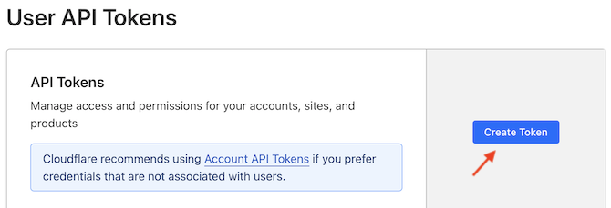
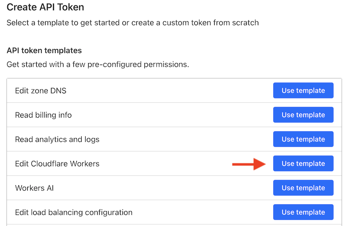
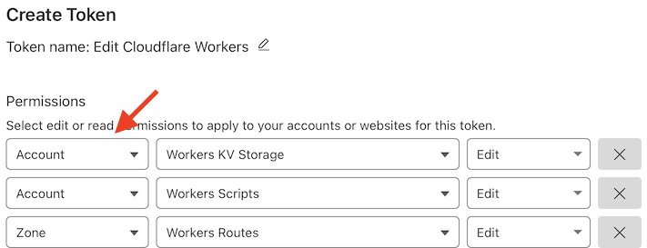
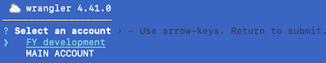

# Cloudflare development

Instructions for how to add `wrangler` CLI to your Multipass setup.

>[!IMPORTANT]
>The author would use two VM's for cloud development: one, plain `npm` for development and another for deployments. This limits the exposure: cloud vendor tokens are available only when needed.
   
Adds to `npm` image:

- `wrangler` CLI

	>Note: Cloudflare says:
	>
	>>*Wrangler is installed locally into each of your projects. This allows you and your team to use the same Wrangler version, control Wrangler versions for each project, and roll back to an earlier version of Wrangler, if needed.*

	We might disobey here. If you are okay always aiming at using the latest tools, and all your projects are relatively active, it might not serve much to version control build/simulation tools, per each project. We treat the CLI as a **global** tool, not a per-project dependency.
	
	Further argument is that one can *build* a Cloudflare web app without having `wrangler` around. It's only needed for simulation and deployment. If it's not needed for the tests, it can remain detached.


## Steps

See [`../README.md`](../README.md) for instructions on the generic tooling.

Set up a VM with `npm`, but name it something else:

```
$ MP_NAME=wrangler ./prep.sh
```

Within that VM, do:

```
$ npm install -g wrangler
```

### CLI login

There are two ways to tie your VM terminal to the Cloudflare account.

They both have their pros and cons. Let's look at each of them in turn, and then you can then choose, which fits best for you. :)


#### A. Using `wrangler login`

The port `8976` needs to be shared from the VM, so we start it by (in the parent folder):

```
$ PORT=8976 MP_NAME=wrangler ./host-tools/launch.sh
```

Within the VM:

```
$ wrangler login browser=false
```

Open the provided URL and Cloudflare lists the permissions you are about to give the VM:


Once the VM states that login has succeeded, you can use the `wrangler` CLI to control your account, make deployments etc.


#### B. Login with API tokens

Using API tokens allows you *minute* control to what the CLI can and can not do. It's always good to run with the minimum set of access rights - especially if you deal with production systems.

Also, some Cloudflare services (e.g. PubSub, as of May'24) [will request you](https://developers.cloudflare.com/pub-sub/guide/#3-fetch-your-credentials) to create a custom access token.

**Creating an API token**

Visit Cloudflare > Dashboard > `Profile` > [API tokens](https://dash.cloudflare.com/profile/api-tokens).

>

- `Create Token`

>

- `Edit Cloudflare Workers` > `Use template`

>

**Notice that the first pull-down menu works as a tree structure for the permissions.** If you don't find something (e.g. "membership") under `Account`, change to `User`.

---

Here are the permissions needed for deploying any Cloudflare Worker app. 

You might want to reduce them a bit - or leave as is. You will also be able to edit these later, for the same token.

Here are the minimum rights the author thinks are necessary, for deploying a static web site:

||permission|can|comment|
|---|---|---|---|
|`Account`|`Account Settings`|`Read`||
|`User`|`User Details`|`Read`|`wrangler whoami` needs this|
|`Account`|`Workers Tail`|`Read`||
|`User`|`Memberships`|`Edit`|`/membership` API; SvelteKit deployment|
|`Account`|`Workers Observability`|`Edit`||

<!--
|`Account`|`Access: Apps and Policies`|`Edit`||
|`Account`|`Cloudflare Pages`|`Edit`|`/accounts/{id}/pages/projects/{project-id}` API; SvelteKit|
-->

<!--
|...|	do not be afraid to edit the set, above
-->

In addition, you may want to change `Account Resources` to just your current account.

If you don't limit the account here (and have access to multiple), you will be interactively *asked* about the account, when doing deployments:



>[!NOTE]
>
>If you later come to edit the permissions, **make sure to** `Continue to summary` and `Update token`:
>
>  

Complete the creation and you'll get a token like `Blah0[...]alhNF`.

>Try it out in the VM:
>
>```
>$ CLOUDFLARE_API_TOKEN={token here} wrangler whoami
>...
>Getting User settings...
>👋 You are logged in with an API Token, associated with the email {snip}!
>┌───────────────────┬───────────────┐
>│ Account Name      │ Account ID    │
>├───────────────────┼───────────────┤
>│ Outstanding Earth │ ...snip...    │
>└───────────────────┴───────────────┘
>🔓 To see token permissions visit https://dash.cloudflare.com/profile/api-tokens
>```

It works.

Add the token in `~/.bashrc` so it gets loaded into the environment at VM restarts.

```
~$ echo "export CLOUDFLARE_API_TOKEN={token here}" >>~/.bashrc 
```

```
~$ . ~/.bashrc
```

<!-- #hidden; don't suggest to have it on all `npm` VM's
>Pst. You can also enter it in `custom.env` on the host side; this way it'll get used for any subsequent VMs you create, automatically.

<p />
-->

>NOTE! 
>It's not a problem if you lose the token. It's easy to recreate one with the same access rights in the Cloudflare console.

Now you are ready to go! 🌞


### Comparison of approaches: A vs. B

||**`wrangler login`**|API tokens|
|---|---|---|
|Setup|by interactive login|by creating API tokens|
|Granularity|coarse|detailed|
|Good for|first tests|production use|
|Products in beta|no|yes|

Using API tokens is the recommended choice, by Cloudflare.


## Maintenance

**Updating (within the sandbox)**

```
$ wrangler --version
```

It will tell you if an update is available. If so:

```
$ npm update -g wrangler
```

## Final... words

You might not need any of the above.

Cloudflare has nice [Workers Builds](https://developers.cloudflare.com/workers/ci-cd/builds/) CI, which can track changes to your GitHub repo, and deploy them automatically.


## References

- Cloudflare PubSub > [Fetch your credentials](https://developers.cloudflare.com/pub-sub/guide/#3-fetch-your-credentials)
- Cloudflare Fundamentals > [API token permissions](https://developers.cloudflare.com/fundamentals/api/reference/permissions/)
