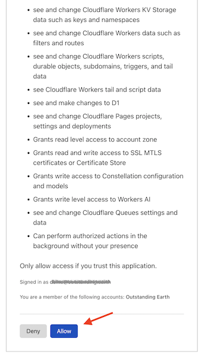
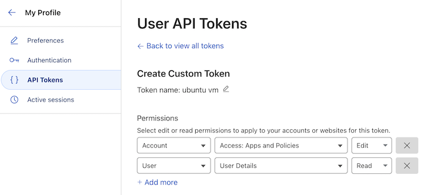

# Cloudflare development

For Web development with [Cloudflare](https://www.cloudflare.com/developer-platform/) as the platform.
   
Adds to `npm` image:

- `wrangler` CLI

	>Note: Cloudflare says:
	>
	>>*Wrangler is installed locally into each of your projects. This allows you and your team to use the same Wrangler version, control Wrangler versions for each project, and roll back to an earlier version of Wrangler, if needed.*

	We might disobey here. If you are okay always aiming at using the latest tools, and all your projects
	are relatively active, it might not serve much to version control build/simulation tools, per each project. We treat the CLI as a **global**
	dependency, not a project-wide one.
	
	Further argument is that one can *build* a Cloudflare web app without
	having `wrangler` around (i.e. with the base `npm` image). It's only
	needed for simulation and deployment. If it's not needed for the tests,
	it can remain detached.


## Prelude

See [`../README.md`](../README.md) for instructions on the generic tooling.

Set up a VM with `npm`.


## Steps

### Installation

Within that VM, do:

```
$ npm install -g wrangler
```


### CLI login

There are two ways to tie your VM terminal to the Cloudflare account:

#### A. Using `wrangler login`

This is normally the easy way, but doing it from within a VM requires a bit of assistance. It also grants a huge number of access rights to your VM - it's kind of a "whole sale" option. In addition, it does not cover services in Cloudflare beta.

Try both and decide for yourself.

<details><summary>Reveal detailed steps</summary>
>
>To do the login dance, the port `8976` of the VM must be visible in your *host* as `localhost:8976` (so that a browser will reach it, after authentication).
>
>Run this:
>
>```
>$ MP_NAME=npm sh/login-fwd.sh
>...
>```
>
>The script sets up a port forward and instructs you to run the command `wrangler login browser=false` in the VM shell, while that port forward is active.
>
>Open the provided URL and Cloudflare lists the permissions you are about to give the VM:
>
>>
>
>Once the VM states that login has succeeded, let the host script run to completion. It will remove the port forwarding.
</details>


#### B. Login with custom API tokens

This is the recommended choice, by Cloudflare. Using API tokens allows you *minute* control to what the CLI can and can not do. It's always good to run with the minimum set of access rights - especially if you deal with production systems.

Also, some Cloudflare services (e.g. PubSub, as of May'24) [will request you](https://developers.cloudflare.com/pub-sub/guide/#3-fetch-your-credentials) to create a custom access token.

One more plus - no special hoops are needed! :) Just a browser, copy-paste. Done!

**Creating an API token**

Visit Cloudflare > Dashboard > `My Profile` > [API tokens](https://dash.cloudflare.com/profile/api-tokens).

>         

**Notice that the first pull-down menu works as a tree structure for the permissions.** If you don't find something (e.g. "membership") under `Account`, change to `User`.

Here are permissions needed for deploying a Cloudflare Pages app (as of Nov'24). You will be able to edit these later, for the same token.

|           | permission                  | can    | comment                                                     |
|-----------|-----------------------------|--------|-------------------------------------------------------------|
| `Account` | `Account Settings`          | `Read` |                                                             |
| `Account` | `Access: Apps and Policies` | `Edit` |                                                             |
| `User`    | `User Details`              | `Read` | `wrangler whoami` needs this                                |
| `User`    | `Memberships`               | `Edit` | `/membership` API; SvelteKit deployment                     |
| `Account` | `Cloudflare Pages`          | `Edit` | `/accounts/{id}/pages/projects/{project-id}` API; SvelteKit |

<!--
|...|	do not be afraid to add more lines, above
-->

In addition, you may want to change `Account Resources` to just your current account.

>Note: 
>If you later come to edit the permissions, **make sure to `Continue to summary` and `Update token`:
>
>  

Complete the creation and you'll get a token like `Blah0[...]fuchS`.

>Try it out in the VM:
>
>```
>~$ CLOUDFLARE_API_TOKEN={token here} wrangler whoami
>...
>Getting User settings...
>👋 You are logged in with an API Token, associated with the email {snip}!
>┌───────────────────┬───────────────┐
>│ Account Name      │ Account ID    │
>├───────────────────┼───────────────┤
>│ Outstanding Earth │ ...snip...    │
>└───────────────────┴───────────────┘
>🔓 To see token permissions visit https://dash.cloudflare.com/profile/api-tokens
>```

It works.

Add the token in `~/.bashrc` so it gets loaded into the environment at VM restarts.

```
~$ echo "export CLOUDFLARE_API_TOKEN={token here}" >>~/.bashrc 
```

```
~$ . ~/.bashrc
```

>Pst. You can also enter it in `custom.env` on the host side; this way it'll get used for any subsequent VMs you create, automatically.

<p />

>NOTE! 
>It's not a problem if you lose the token. It's easy to recreate one with the same access rights in the Cloudflare console.

Now you are ready to go! 🌞

## Maintenance

**Updating (within the sandbox)**

```
$ wrangler --version
```

It will tell you if an update is available. If so:

```
$ npm update -g wrangler
```

## References

- Cloudflare PubSub > [Fetch your credentials](https://developers.cloudflare.com/pub-sub/guide/#3-fetch-your-credentials)
- Cloudflare Fundamentals > [API token permissions](https://developers.cloudflare.com/fundamentals/api/reference/permissions/)
