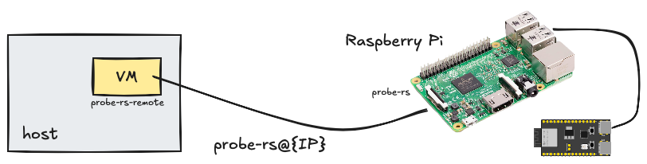

# Rust development with Embassy

Intended for [Embassy](https://embassy.dev) development, this VM sets up:

- RISC V Rust compilation targets (C3, C6)
- [probe.rs](https://probe.rs/) remote connection to a computer with `probe-rs` installed
- (optional) Xtensa Rust toolchain and targets

<!-- tbd.
- `nightly` toolchain, as long as it's needed/favoured by Embassy
-->


## Overall




You'll be connecting the development kit (e.g. [ESP32-C3-DevKitM-1](https://docs.espressif.com/projects/esp-idf/en/v5.2/esp32c3/hw-reference/esp32c3/user-guide-devkitm-1.html#esp32-c3-devkitm-1)) to *another* computer; either a Raspberry Pi or a PC, which needs to have `probe-rs` installed. 

This gives the benefit that you don't need to physically connect your development board (with custom electronic experiments) to your primary computer. <small>*Plus, with using Multipass VM's not having USB sharing, you'll need a way to reach for such devices over Ethernet/WLAN, anyways.*</small>


## Prelude

See [`../rust/README.md`](../rust/README.md) for instructions on generic tooling.

## Usage

Create the VM by:

```
$ rust+emb/prep.sh
...
Multipass IP (rust-emb): 192.168.64.101

probe-rs 0.24.0 (git commit: 6fc653a)
```

### Xtensa based chips

To enable Xtensa targets, add `XTENSA=1` before the command. Be aware that this consumes ~1.5GiB more disk space from the image.


## Preparing the target device

Follow the instructions in the [`probe-rs-remote`](https://github.com/lure23/probe-rs-remote) (GitHub) repo, to set up the remote machine.

Before using `probe-rs`, edit the `~/.bashrc` within the VM image, to have it point to the correct destination. Other than this, `probe-rs` remote will be installed on your VM, automatically.

```
$ nano ~/.bashrc
...
# EDIT AND UNCOMMENT THIS
#export PROBE_RS_REMOTE=probe-rs@192.168.1.199
```

<!-- tbd. `prep` *SHOULD* ask for the destination user/IP right up front, interactively! -->


## Mounting work folders

The idea is that your software would remain on the host disk, shared with the Multipass VM (where the development tools sans IDE reside).

Say you have a folder `/Users/mike/Git/some-project`. This is how to share it with the VM, as `~/some-project`.

>Note: We use "native" folder sharing, which is said to be faster than the default. It does, however, need the VM to be stopped when mounts are added/removed.

```
[host]$ multipass stop rust-emb
```

```
[host]$ multipass mount --type=native /Users/mike/Git/some-project rust-emb:/home/ubuntu/some-project
```

```
[host]$ multipass shell rust-emb
```


## Maintenance

**Updating (within the sandbox)**

```
$ rustup update
```
   
```
$ cargo install probe-rs-tools
```

### After kernel update

You _must_ update `linux-modules-extra-$(uname -r)` _manually_ when kernel changes. See the instructions in [`rust+emb/linux/usbip-drivers.sh`](./rust+emb/linux/usbip-drivers.sh).

>Note: You may also need to restart the VM, i.e. (on the host):
>
>```
>$ multipass stop rust-emb; multipass shell rust-emb
>```

### `probe-rs-remote`

`~/bin/probe-rs-remote` script currently needs manual care, if you wish to bring updates to it. See [`linux/probe-rs-remote.sh`](linux/probe-rs-remote.sh).


## References

- [`probe-rs` docs](https://probe.rs/docs/)
