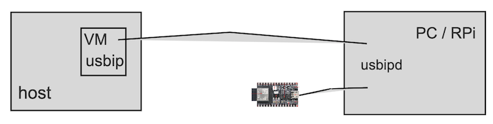

# Rust development with Embassy

Intended for [Embassy](https://embassy.dev) development, this VM sets up:

- RISC V Rust compilation targets (C3, C6)
- [espflash](https://github.com/esp-rs/espflash)
- [probe.rs](https://probe.rs/)
- (optional) Xtensa Rust toolchain and targets
- `nightly` toolchain, as long as it's needed/favoured by Embassy

>`usbip` client is already installed by `rust` recipe.


## Overall



You'll be connecting the development kit (e.g. [ESP32-C3-DevKitM-1](https://docs.espressif.com/projects/esp-idf/en/v5.2/esp32c3/hw-reference/esp32c3/user-guide-devkitm-1.html#esp32-c3-devkitm-1)) to *another* computer; either a Raspberry Pi or a PC, and passing the USB information over to the Multipass VM via USB/IP protocol. We'll give details on how to set this up, below.

This gives the benefit that you don't need to physically connect your development board (with custom electronic experiments) to your primary computer.

>**Using on just one computer**
>
>If you have a PC (Windows 10 or Linux), this can be done. Just follow the same instructions below. For Mac, the author is not aware of good `usbipd` host software.


## Prelude

See [`../rust/README.md`](../rust/README.md) for instructions on generic tooling.

## Usage

Create the VM by:

```
$ rust+emb/prep.sh
...
Multipass IP (rust-emb): 192.168.64.101

probe-rs 0.24.0 (git commit: 6fc653a)
```

### Xtensa based chips

To enable Xtensa targets, add `XTENSA=1` before the command. Be aware that this consumes ~1.5GiB more disk space from the image.


## Preparing the target device

Multipass does not support passing of USB devices from host to VM, so we use USB/IP (USB-over-IP) instead. 

‼️See [ESP32-Mac](https://github.com/lure23/ESP32-Mac?tab=readme-ov-file#alternative-b-connecting-the-device-through-windows) for instructions on how to set up `usbipd` hosting.

The instructions below are on the ESP32-C3 DevKit-M1 board. If you have another board, the steps should be similar but different. Consult its manual!

With the help of that repo:

- Have USB/IP set up between the PC/RPi and your VM
- See that you can reach the device via `probe-rs`

<!-- tbd. give test instructions for each of the above steps
-->

<!-- tbd. Move much of this stuff to (revised `ESP32-Mac` - it deserves to be there!

### Connect the devkit (USB); start USB/IP sharing

Connect the development board to your PC/RPi. If it needs drivers, install them.

>See [Establish Serial Connection with ESP32](https://www.google.com/url?sa=t&source=web&rct=j&opi=89978449&url=https://docs.espressif.com/projects/esp-idf/en/stable/esp32/get-started/establish-serial-connection.html&ved=2ahUKEwikh-etgLWGAxUPJRAIHdwSDVwQFnoECBUQAQ&usg=AOvVaw047kPSwHcYVvG7s8epqZTL) (Espressif docs)

-->

## Mounting work folders

The idea is that your software would remain on the host disk, shared with the Multipass VM (where the development tools sans IDE reside).

Say you have a folder `/Users/mike/Git/some-project`. This is how to share it with the VM, as `~/some-project`.

>Note: We use "native" folder sharing, which is said to be faster than the default. It does, however, need the VM to be stopped when mounts are added/removed.

```
[host]$ multipass stop rust-emb
```

```
[host]$ multipass mount --type=native /Users/mike/Git/some-project rust-emb:/home/ubuntu/some-project
```

```
[host]$ multipass shell rust-emb
```


## Maintenance

**Updating (within the sandbox)**

```
$ rustup update
```
   
```
$ cargo install probe-rs-tools
```

## References

- [`probe-rs` docs](https://probe.rs/docs/)
