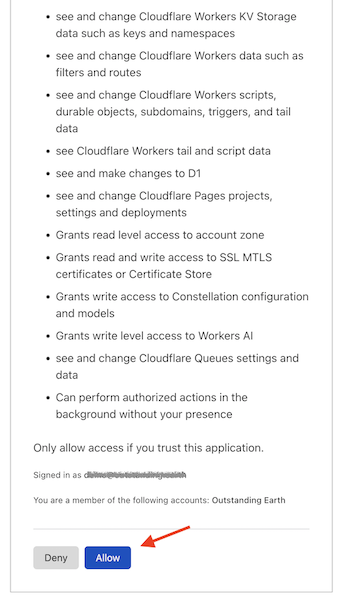

# Web + Cloudflare development

For Web development with Cloudflare as the platform.
   
Has:

- `node` (derived)
- `npm` (derived)

- `wrangler` CLI

	>Note: Cloudflare says:
	>
	>>*Wrangler is installed locally into each of your projects. This allows you and your team to use the same Wrangler version, control Wrangler versions for each project, and roll back to an earlier version of Wrangler, if needed.*
	>
	> We might disobey here, though. If you are okay always aiming at using the latest tools, and all your projects
	> are relatively active, it might not serve much to version control build/simulation tools, per each project.

	<!-- #whisper
	<p />
	
	>Also note: `wrangler` (globally installed) is 3x faster than `npx wrangler`, for each command.
	
	<!_-- evidence:
   ```
    $ time wrangler whoami
    ...
    real	0m3.018s
    user	0m0.966s
    sys	0m0.660s
    ```

    ```
    $ time npx wrangler whoami
    ...
    real	0m11.340s
    user	0m1.896s
    sys	0m1.429s
    ```
	-->

## Prelude

>See [`../web/README.md`](../web/README.md) for instructions on the generic tooling.

## Using

Create the VM by:

```
$ web+cf/prep.sh
```

### CLI login

There are two ways to tie your VM terminal to the Cloudflare account:

#### A. Using `wrangler login`

This is normally the easy way, but doing it from within a VM requires a bit of assistance. It also grants a huge number of access rights to your VM - it's kind of a "whole sale" option. In addition, it does not cover services in Cloudflare beta.

You may try both and decide for yourself.

<details><summary>Reveal detailed steps</summary>
>
>To do the login dance, the port `8976` of the VM must be visible in your *host* as `localhost:8976` (so that a browser will reach it, after authentication).
>
>Run this:
>
>```
>$ web+cf/login-fwd.sh
>...
>```
>
>The script sets up a port forward and instructs you to run the command `wrangler login browser=false` in the VM shell, while that port forward is active.
>
>Open the provided URL and Cloudflare lists the permissions you are about to give the VM:
>
>>
>
>Once the VM states that login has succeeded, let the host script run to completion. It will remove the port forwarding.
</details>


#### B. Login with custom API tokens

Using API tokens allows you *minute* control to what the CLI can - and can not - do. This author prefers this in the long run, since it's always good to run with the minimum set of access rights - especially if you deal with production systems.

Also, some Cloudflare services (e.g. PubSub, as of May'24) [will request you](https://developers.cloudflare.com/pub-sub/guide/#3-fetch-your-credentials) to create a custom access token.

One more plus - no special hoops are needed! :) Just a browser, copy-paste. Done it!

**Creating an API token**

Visit Cloudflare > Dashboard > `My Profile` > [API tokens](https://dash.cloudflare.com/profile/api-tokens).

>         

Notice that the first pull-down menu works as a tree structure for the permissions.

Give permissions that you need. You will be able to edit these later, for the same token.

||permission|can|comment|
|---|---|---|---|
|`User`|`User Details`|`Read`|`wrangler whoami` needs this|
|...|

<!-- tbd.
><font color=orange>*tbd.* Add more lines above, once we see where they are needed!</font>
-->

Complete the creation and you'll get a token like `Blah0[...]fuchS`.

>Try it out in the VM:
>
>```
>~$ CLOUDFLARE_API_TOKEN={token here} wrangler whoami
>...
>Getting User settings...
>👋 You are logged in with an API Token, associated with the email {snip}!
>┌───────────────────┬───────────────┐
>│ Account Name      │ Account ID    │
>├───────────────────┼───────────────┤
>│ Outstanding Earth │ ...snip...    │
>└───────────────────┴───────────────┘
🔓 To see token permissions visit https://dash.cloudflare.com/profile/api-tokens
>```

It works.

Add the token in `~/.bashrc` so it gets loaded into the environment at VM restarts.

```
~$ echo "export CLOUDFLARE_API_TOKEN={token here}" >>~/.bashrc 
```

```
~$ . ~/.bashrc
```

>NOTE! Do place a copy of the token in a "safe place", especially if you intend to use it over longer periods. VM instances are kind of meant to be easily removed and re-created from scratch (by `multipass delete --purge`).

Now you are ready to go! 🌞

## Maintenance

**Updating (within the sandbox)**

```
$ wrangler --version
```

It will tell you if an update is available. If so:

```
$ npm update -g wrangler
```

>Note. Before `3.60.3`, there were difficulties with the update. If you get any, you can just remove the wrangler state before reinstalling:
>
>```
>rm -rf ~/.npm-packages/lib/node_modules/wrangler
>```

<!--
3.60.3 -> 3.61.0		went fine
3.61.0 -> 3.62.0		went fine
-->

## References

- Cloudflare PubSub > [Fetch your credentials](https://developers.cloudflare.com/pub-sub/guide/#3-fetch-your-credentials)

