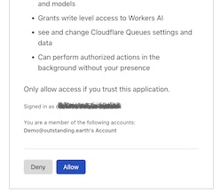

# Web development

For Web development. 
   
Has:

- `node`
- `npm`

## Using: exposing the port

To have the VM expose its port to outside world (not only `localhost`):

1. Add something like this:

   ```
   // vite.config.js
   export default defineConfig({
      server: {
         host: "0.0.0.0"
      },
   ```

2. Get the VM's IP e.g. from `multipass info web`. <sup>`|*|`</sup>

   e.g. `192.168.64.85`

You can now open the port in host browser.

<small>`|*|`: It stays the same for each launch, but varies over separate launches.</small>

## Using: installing a CLI

Cloud CLIs often use a browser dance.

1. Establish port forwarding from host `localhost:8976` to VM's `:8976`.

   ```
   $ sudo ssh -i /var/root/Library/Application\ Support/multipassd/ssh-keys/id_rsa -L 8976:localhost:8976 ubuntu@192.168.64.92
   ```

   Keep the resulting `ssh` session open; port forwarding is valid as long as it is. `|**|`

   The IP is naturally the IP of your local VM.
   
	The port number differs based on your product. Cloudflare `wrangler` uses 8976. You can *usually* see the port number mentioned in the URL that the login dance (see next step) exposes for you. :)

   >Note: Multipass doesn't have port forwarding as part of its feature set, but it's pretty easy to do manually (as per above).

   <small>`|**|`: Do you know how to forward the ports, but not open a terminal session? Please let the author know.</small>

2. Run the login command in the VM

   ```
   $ wrangler login
 ⛅️ wrangler 3.51.2
-------------------
Attempting to login via OAuth...
Opening a link in your default browser: https://dash.cloudflare.com/oauth2/auth?response_type=code&client_id=[...]&redirect_uri=http%3A%2F%2Flocalhost%3A8976[...]
▲ [WARNING] Failed to open
   ```

   Pick the URL; copy-paste to a host browser.

3. Follow the instructions

   

<!-- lost it
   
-->

3. Once you are finished, you can close the `ssh` session (step 1).

   The VM is now allowed to work on your behalf. If you recreate it, you naturally need to renew the auth dance <font color=gray>(or map the folders so that such information remains on the host side)</font>.


## Maintenance 

**Updating (within the sandbox)**
   
```
$ sudo npm install -g npm
```

`npm` will remind you of that, no doubt

